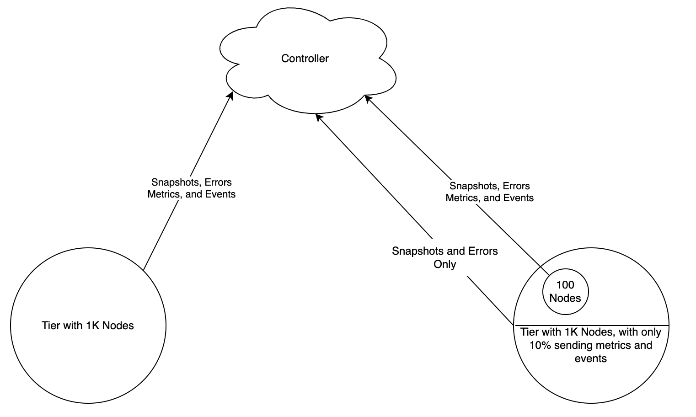

# AppDynamics Java Agent Statistical Reduction Dynamic Service Extension - The [Hoi Polloi](https://en.wikipedia.org/wiki/Hoi_polloi) Plugin!

[](https://developer.cisco.com/codeexchange/github/repo/jbsouthe/AppDynamics-Statistical-Dynamic-Service)
[Github Link To This Repo](https://github.com/jbsouthe/AppDynamics-Statistical-Dynamic-Service)

This extension allows the AppDynamics Java Agent to decide on startup whether it should send metrics to the controller.
In very large tiers, this data can be represented using a smaller collection of the similar sourced population data to represent the actual merits and support higher loads.
In tiers with 100 or more agents, the metrics reported are usually very similar in definition and volume, which means we are ingesting duplicate data that is not significantly different per node.
To handle this more elegantly at scale, this plugin proposes to reduce metric collection on a subset of nodes, without impacting APM.
In a hypothetical population of 1000 nodes, if we select a percentage of 10% to send data, we can take the data received and multiply it by 100/10 == 10 to calculate the missing data through linear extrapolation. 



This plugin is in BETA and not supported by AppDynamics, please report any issues to this github repository and our team will respond as soon as possible.

## Theory of Operation "how does it work"

The agent dynamic service needs to be installed and then node properties from the Controller UI will dictate how it acts
setting the following will cause it to perform the updates. The service will run and check for upgrades every 3 minutes, so when changing these parameters make sure to allow time to see execution.

    "agent.statisticalSampler.enabled" - boolean, setting this to true causes this service to come alive
    "agent.statisticalSampler.decisionDurationMinutes" - integer configuring the number of minutes to allow an agent to run before checking for a new sampling determination. 
    "agent.statisticalSampler.percentage" - the percentage of agents sending data, recommended 10%, as an int 1-100, if higher than 100 we will select 100 (this effectively disables statistical sampling, without disabling the plugin), if lower than 1 we set to 1
    "agent.statisticalSampler.maxEvents" - when chance dictates, set max events to this new value, 0 disables events, otherwise it sets it to the new value

Once enabled, it will determine randomly if the agent should enable metrics, and then it will run every "agent.statisticalSampler.decisionDurationMinutes" and decide once again whether it will continue to disable/enable metrics and randomly make the decision again.
The logic of this is:

```java
Integer percentageOfNodesSendingData = agentNodeProperties.getEnabledPercentage(); //assume this is 10% for the examples in the logic below
int r = (int) (Math.random() *100);
if( r > percentageOfNodesSendingData ) { //if r > 10% (the large number)
    Disable Metrics and Events for this node
} else {//else r <= 10%; so continue
    Enable Full Metrics and Events for this node
}
```

## Installation - You only have to do this once

Some setup. This should be installed in the < agent install dir >/ver22.###/external-services/Statistical-Sampling directory
the < agent intall dir >/ver22.###/conf/app-agent-config.xml at line 120 has to have signing disabled in the "Dynamic Services" section:

    <configuration-properties>
        <property name="external-service-directory" value="external-services"/>
        <property name="enable-jar-signing" value="false"/>
    </configuration-properties>


## How to "do it"

Custom node properties control these activities. Setting the <B>"agent.statisticalSampler.enabled"</B> node property to true will enable this service, when this service is disabled it will enable metrics collection as it removes itself. 
Setting the node property <B>"agent.statisticalSampler.percentage"</B> to an integer between 1 and 99 will set the percentage of nodes enabled to send metrics as part of this statistical set.


note: this percentage of 99, is so high that the nodes will barely be using this, try not to set your target this high, this example was for testing. 10% is the recommended level.

## How to Monitor what it is doing

The new service will publish metrics, if not being throttled, to the controller under the Agent metrics. In the future every agent will continue to publish these basic metrics, but for today we are just shutting off all metrics including these ones, so only the agents not being stopped will report them.


Additionally, when the service calculates whether or not a node will be sending events and metrics it will attempt to send an event informing of change in status, just as metrics this will one day filter out all but critical events, today it will shut off all events.


